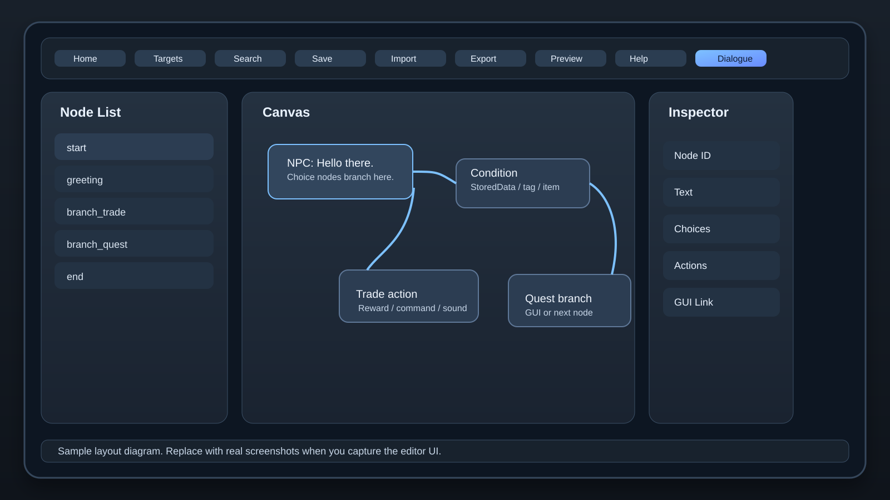
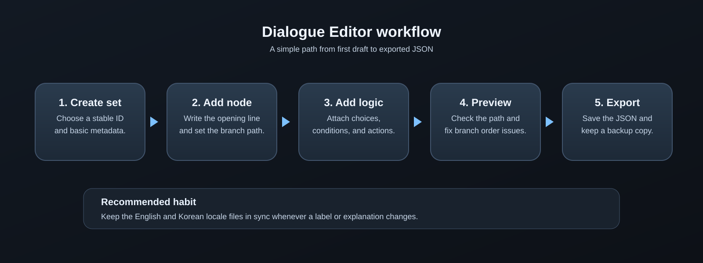

# Dialogue Editor Wiki

> Translation key: `wiki.title`

Dialogue Editor is the main place to build NPC dialogue sets in Dochi Editor. It handles node flow, branch choices, conditions, actions, GUI mapping, and runtime preview inside Minecraft.

> Translation key: `wiki.intro`

This page is the canonical English source for the Dialogue Editor manual. Localized pages should use the strings in `i18n/dialogue-editor-wiki.en_us.json` and `i18n/dialogue-editor-wiki.ko_kr.json`.

## Quick Start

> Translation key: `wiki.quick_start.title`

1. Open Dochi Editor inside a Minecraft world.
2. Choose `Dialogue Editor` from the main menu.
3. Create a new dialogue set.
4. Add the first node and fill in its text.
5. Add choices, conditions, and actions.
6. Connect a GUI JSON if the dialogue uses a custom screen.
7. Export the dialogue to `dc_data/dc_dialogues`.
8. Test the branch flow in runtime and adjust the order if needed.

## Requirements

> Translation key: `wiki.requirements.title`

| Item | Purpose |
| --- | --- |
| Dochi Editor | Provides the editor UI and file bridge. |
| CustomNPCs | Stores dialogue JSON and runtime data. |
| CNPCExtended | Supports extended GUI and HTML-based runtime features. |
| MCEF | Renders the editor inside Minecraft. |
| Image assets | Provide screenshots, diagrams, and layout callouts for the wiki. |

If the dialogue links to a custom GUI, keep the target world open when you install or update that GUI package.

## Folder Rules

> Translation key: `wiki.paths.title`

| Content | Path |
| --- | --- |
| Dialogue JSON | `minecraft/customnpcs/dc_data/dc_dialogues` |
| GUI JSON | `minecraft/customnpcs/dc_data/dc_gui` |
| Manual source | `wiki/dialogue-editor-wiki.md` |
| Locale strings | `wiki/i18n/dialogue-editor-wiki.*.json` |
| Wiki images | `wiki/assets/dialogue-editor/` |

Dialogue data should keep stable IDs and simple file names. Use lowercase letters, numbers, underscores, and hyphens where possible.

## Screen Layout

> Translation key: `wiki.layout.title`

The editor is easiest to read when you treat it as three working zones: a node list, a central canvas, and a property inspector.



| Panel | Use |
| --- | --- |
| Node list | Shows nodes, search, and branch order. |
| Canvas | Holds the dialogue text, choice wiring, and route preview. |
| Inspector | Edits the selected node, choice, condition, or action. |
| Toolbar | Saves, imports, exports, and opens helper panels. |

## Node Workflow

> Translation key: `wiki.workflow.title`



1. Create the dialogue set and give it a stable ID.
2. Add the first node and write the opening line.
3. Add choices that point to the next node or action.
4. Attach conditions where a choice or node should only appear sometimes.
5. Add actions for rewards, commands, sounds, or state changes.
6. Preview the path and confirm the branch order feels natural.
7. Export the finished JSON and keep a backup copy before larger edits.

## Choices And Branching

> Translation key: `wiki.choices.title`

Choices are what the player clicks. Each choice usually carries four ideas:

| Field | Use |
| --- | --- |
| Choice text | The line the player sees in the menu. |
| Target node | Where the branch continues after selection. |
| Condition | When the choice should appear. |
| Action | What should happen after the choice is picked. |

Keep branch names short. A dialogue tree is much easier to maintain when nodes are named after purpose instead of the exact line of text.

## Conditions

> Translation key: `wiki.conditions.title`

Conditions are the guardrails that keep a node or choice from appearing too early.

| Condition type | Typical use |
| --- | --- |
| StoredData | Track per-player or per-NPC progress. |
| Tags | Gate branches by server or quest state. |
| Inventory | Show a branch only when the player has a required item. |
| Currency | Check whether the player can afford a branch or reward. |
| Custom checks | Reuse mod- or pack-specific logic. |

When a branch is hidden by a condition, make the rule explicit in the node notes so future editors do not have to guess.

## Actions And FX

> Translation key: `wiki.actions.title`

Actions run when a node opens or a choice is selected, depending on how the dialogue is configured.

| Action type | Typical use |
| --- | --- |
| Command | Trigger server commands or scripted behavior. |
| Item | Give, remove, or consume an item. |
| Sound | Play a sound cue on branch entry or exit. |
| Text FX | Control color, pacing, emphasis, or reveal timing. |
| State change | Update tags, counters, or flags for later branches. |
| GUI open | Send the player into a custom GUI screen. |

Use the smallest action set that gets the job done. That keeps the dialogue easier to debug later.

## GUI Mapping

> Translation key: `wiki.gui.title`

Dialogue Editor can connect to GUI JSON made in GUI Maker. That lets a dialogue branch open a custom screen instead of only showing text.

| Mapping point | Note |
| --- | --- |
| GUI JSON path | Match the exported GUI file that the dialogue should open. |
| Runtime path | Keep the runtime asset path aligned with the source file location. |
| Preview path | The preview image path can differ from the runtime asset path, so check both. |
| Trigger | Decide whether the GUI opens on node entry or on a choice action. |

When a dialogue uses a custom screen, test the GUI and the dialogue together. A good dialogue tree can still feel broken if the GUI path is wrong.

## Images And Screenshots

> Translation key: `wiki.images.title`

The wiki accepts PNG, JPEG, GIF, and SVG files. Put them in `wiki/assets/dialogue-editor/` and use descriptive file names such as `dialogue-editor-node-tree.png`.

You can embed images with normal Markdown syntax:

```md

```

Use images for:

- Layout overviews
- Node and branch diagrams
- Inspector callouts
- Troubleshooting examples
- Before-and-after comparisons

The two SVG files in this folder are sample diagrams. Replace them with real screenshots when you capture the editor UI.

## Import And Export

> Translation key: `wiki.import_export.title`

Import is useful when you are moving from a sample file or an older draft. Export is the final save step before you test in-game.

Before large edits, keep a backup of the entire `dc_data/dc_dialogues` folder. If a dialogue tree becomes hard to understand, export a clean copy and compare the two versions instead of editing in place forever.

## Troubleshooting

> Translation key: `wiki.troubleshooting.title`

| Symptom | Likely cause | Fix |
| --- | --- | --- |
| Choice never appears | A condition hides it or the branch target is wrong. | Check the condition and target node name. |
| Dialogue opens but the flow feels broken | A node points to the wrong branch or the order is unclear. | Review branch names and the node preview. |
| GUI does not open | The GUI JSON path does not match the exported file. | Recheck the GUI mapping and runtime path. |
| Image does not show | The path is wrong or the file is not in a supported format. | Use a relative path and PNG, JPEG, GIF, or SVG. |
| Export fails | Required IDs or node fields are missing. | Fill the missing fields, then export again. |
| Korean and English text drift apart | One locale file was updated without the other. | Keep both JSON locale files in sync. |

## Recommended Workflow

> Translation key: `wiki.recommended.title`

1. Sketch the dialogue tree on paper or in a note first.
2. Create the nodes and the main happy-path branch.
3. Add conditions only after the base flow works.
4. Add actions and GUI mapping once the branch order feels stable.
5. Embed images after the text is readable.
6. Export, test in-game, and trim any confusing branch names.
7. Update both locale files at the same time when text changes.

